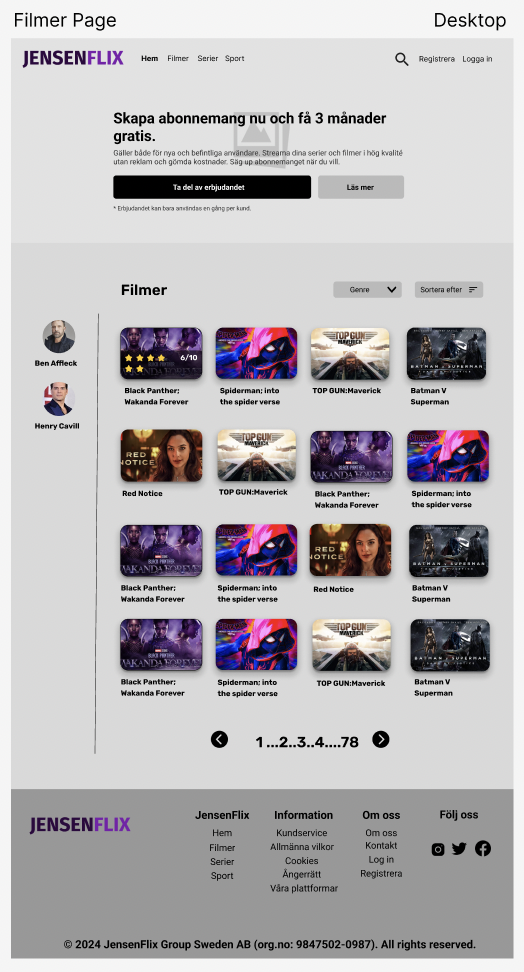
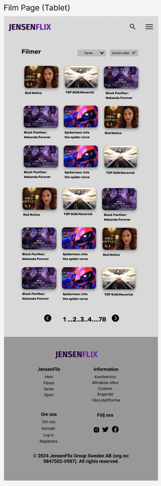
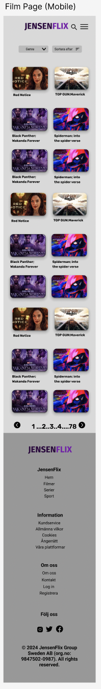

JensenFlix

tips:
- tänk på att <input> och <button> inte ärver CSS för text, så som storlek, font, osv. detta måste anges manuellt igen i varje element.

använd "Semantic Commit Messages"
https://gist.github.com/joshbuchegia/6f47e86d2510bce28f8e7f42ae84c716 och https://www.conventionalcommits.org/en/v1.0.0-beta.2/ 
t.ex. feat: (new feature for the user, not a new feature for build script)
      fix: (bug fix for the user, not a fix to a build script)

      commit -m "fix: (bug fix for the user, not a fix to a build script)"

vem som gör vad i baslayouten:
- hampus: navigationen
- axel: header & logga
- jonathan & roza: footer

vem som gör vilken sida: 
- registrering, inloggning och betalmetod: hampus
- förstasidan & sök : axel
- lista med filmer: jonathan
- om oss & kontakta oss: roza

sidor som ska göras: förstasidan, sida med lista över filmer

färgschema: https://colorhunt.co/palette/2e073f7a1cacad49e1ebd3f8
bakgrund: #19161c
tema: #512B81

# Grafisk Profil (Filmsida Jonatan)

## Färgval:
Mörklila, lila och ljusblå är de dominerande färgerna, med inslag av vitt och nyanser av lila. Lila nyanser förknippas ofta med dramatik, lyx, premium, framgång och kreativitet. Den lila färgen skapar en stark identitet och ger en modern känsla, vilket ger en sofistikerad kontrast och bra läsbarhet. Blått är en väldigt populär färg i webbdesign och både blått och lila upplevs ofta som seriösa, trygga och lugnande.

## Typografi:
Användningen av **Roboto** som huvudtypsnitt, med *sans-serif* som fallback, ger sidan en modern och ren känsla. Typsnittet är lättläst både på stora skärmar och mindre enheter, vilket förbättrar användarupplevelsen genom att säkerställa god läsbarhet.

## Bildmaterial:
Bilder på filmerna är centralt placerade och användningen av affischer i bildkort ger en känsla av att bläddra i en digital videobutik. Detta gör sidan mer visuell och engagerande.

# UX-perspektiv (Användarupplevelse)

## Responsivitet:
Designen är responsiv och anpassar sig väl till olika skärmstorlekar (desktop, tablet, mobil). På desktop finns en bredare grid-layout med fler filmer per rad, medan tablet och mobilversionerna smalnar av för att ge användaren en enkel skrollupplevelse. Detta säkerställer att användaren får en konsistent och lättnavigerad upplevelse oavsett enhet.

## Navigering:
Tydlig navigering finns genom den horisontella menyn högst upp med en enkel och minimalistisk stil. På mobil och tablet ersätts den med en **hamburgermeny**, vilket är en vanlig praxis för att spara utrymme och göra gränssnittet mer renodlat.  
En enkel sökfunktion samt filtrering baserat på "Genre" och "Sortera efter" hjälper användaren att snabbt hitta relevant innehåll, vilket förbättrar användarupplevelsen genom att minska tiden det tar att navigera genom stora innehållsbibliotek.

## Pagination:
Paginering längst ner på sidan gör det lätt för användaren att navigera genom ett stort urval av filmer utan att överbelasta skärmen med för många objekt samtidigt. Tydliga pilar för att bläddra mellan sidor gör processen intuitiv.

## Användarinteraktion:
Stora knappar med tydlig text (exempelvis "Ta del av erbjudandet" och "Läs mer") gör det enkelt att interagera med sidan. Att visa **betyg** på filmer direkt ger en användbar guide för snabbare beslut, vilket minskar kognitiv belastning för användaren.

# UI-perspektiv (Användargränssnitt)

## Grid-layout:
På desktop används ett flerradigt grid-system för att maximera utrymmet och visa fler filmer samtidigt, medan på tablet och mobil visas färre element per rad för att anpassa sig till mindre skärmar och ge en mer användarvänlig vertikal upplevelse. Den enkla grid-layouten gör att sidan känns strukturerad och lätt att förstå visuellt.

## Horisontell och vertikal balans:
Layouten är välbalanserad mellan horisontella och vertikala element. På desktop finns en tydlig sidomeny till vänster med profiler för skådespelare som medverkar i filmen man hovrar på (exempelvis **Ben Affleck** och **Henry Cavill**), vilket gör användarupplevelsen mer dynamisk. På mobil och tablet försvinner denna meny för att spara plats, vilket förbättrar den vertikala skrollupplevelsen.

färgschema: mörkt + lila (se CSS för hex koder)

Grafisk profil första sidan (Axel):
Färgerna som ska användas i sidan har tänkt på mörkt läge med en mörklila färg (se loggan), oftast då användaren använder tjänsten på kvällen då det är mörkt, och då är det trevligt om designen också är mörk, så man inte sitter i mörkret och blir bländad av vita färger. Detta syns dock inte i skissen då jag valde att jobba mest med svarta/vita färger.

Headern visas på alla sidorna, och har designats för att fånga användarens fokus, genom att med stor text komma med ett generöst erbjudande där de får 3 månader gratis när de skapar ett abonnemang hos tjänsten. Knappen för att bli medlem är stor och täcker en stor yta så att den inte går att missa, och det finns även en liten fotnot för de som tror att man bara kan skapa ett oändligt antal konton för att få erbjudandet igen, för det gäller bara en gång per kund. Eftersom att headern ska täcka mestadels av sidan när man först laddar in den (i toppen) så finns det även en stor bakgrundsbild som är blurrad, vilket kommer från Game of Thrones. Alltså är detta användaren kommer att se när de först besöker sidan, att det finns ett stort erbjudande för dem, vilket kan locka dem att betala för tjänsten.

Priserna som visas har designats så att den prisplanen som är "mest värt för pengarna" lyfts fram och är större än de andra, för att försöka få användaren att välja just den prisplanen. Den prisplanen är lite dyrare än den billigaste men billigare än den dyraste, och erbjuder ändå nästan allt, vilken får användaren att tro att det är en bra deal. Jag har också valt att visa användaren vad de får för sina pengar, vad prisplanen erbjuder, just för att de ska lockas att köpa det.

Om användaren inte är helt säker på om de vill köpa tjänsten än, har jag placerat de 5 trendigaste och mest populäraste filmerna och serierna under priserna. De kommer att fortsätta scrolla lite och förhoppningsvis plötsligt se att det finns något som just de tycker om på den här tjänsten, och då kommer de betala för att kunna titta på det. Bilderna som används för detta är poster-bilderna från IMDb.

Om man fortfarande inte är helt säker, eller om det inte finns något som intresserar en, visas en del där man ser vad mer man får som medlem. Det som verkligen ska locka här är flexibiliteten och hur användarvänligt det är. Då många tjänster som Netflix idag bara tillåter en användare åt gången, kommer tjänsten arbjuda oändligt många användare osv. Alltså inga begränsningar alls. Detta ska ge tjänsten en fördel över de andra tjänsterna och få användaren att betala för vår tjänst istället.

Under detta har vanliga frågor placerats, med svar. Istället för att behöva Googla eller kontakt kundtjänst så visar man de vanligaste frågorna på framsidan istället, där de kan kommas åt enkelt. Jag har valt att använda mig av ett system (i teorin) där man klickar på en fråga och så visas en box med svaret, detta för att jag inte vill att frågor och svar ska ta upp så mycket utrymme.

Till sist kommer vi till slutet på sidan och där visas ett generellt utbud av filmer och serier som användaren lite snabbt kan kolla igenom (sidvis), och om de då ser något de gillar behöver de inte scrolla upp hela vägen till toppen igen, för då finns det ett input precis under detta där de kan skriva in sin e-post address och snabbregistrera sig. Jag gjorde det på det här sättet för att försöka locka användaren att bli medlem, då det är väldigt enkelt, allt de ser är att de behöver skriva in sin e-post address.

