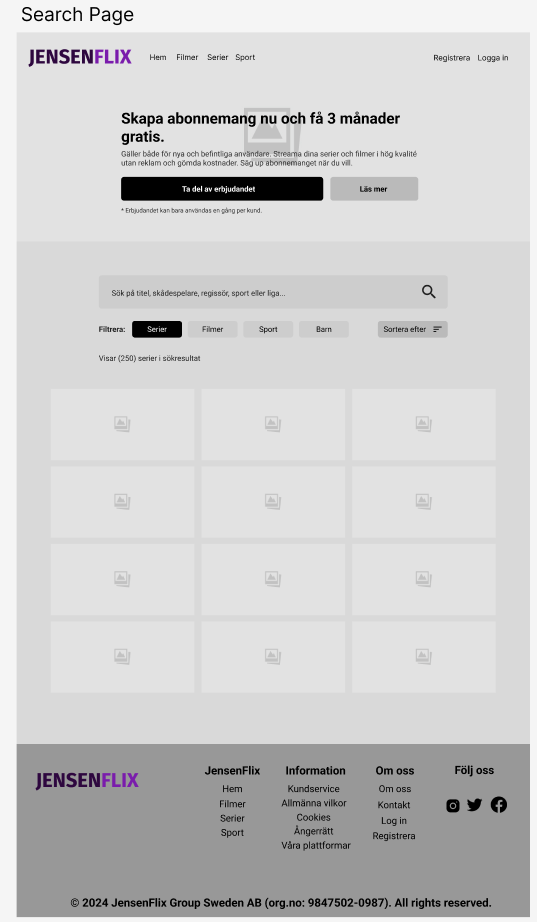

JensenFlix

tips:
- tänk på att <input> och <button> inte ärver CSS för text, så som storlek, font, osv. detta måste anges manuellt igen i varje element.

använd "Semantic Commit Messages"
https://gist.github.com/joshbuchegia/6f47e86d2510bce28f8e7f42ae84c716 och https://www.conventionalcommits.org/en/v1.0.0-beta.2/ 
t.ex. feat: (new feature for the user, not a new feature for build script)
      fix: (bug fix for the user, not a fix to a build script)

      commit -m "fix: (bug fix for the user, not a fix to a build script)"

vem som gör vad i baslayouten:
- hampus: navigationen
- axel: header & logga
- jonatan & roza: footer

vem som gör vilken sida: 
- registrering, inloggning och betalmetod: hampus
- förstasidan & sök : axel
- lista med filmer: jonatan
- om oss & kontakta oss: roza

färgschema från: https://colorhunt.co/palette/35155d512b814477ce8cabff

# Verksamhetsbeskrivning
Vår streamingplattform erbjuder användare enkel och obegränsad tillgång till ett brett urval av filmer och serier från olika genrer och regioner. Med fokus på högkvalitativt innehåll och användarvänlighet, tillhandahåller vi ett omfattande bibliotek som ständigt uppdateras med de senaste titlarna samt klassiker från både stora studios och oberoende skapare.

Vi strävar efter att ge våra användare en flexibel och personlig underhållningsupplevelse, med funktioner som topplistor, offline-tjänster, samt stöd för att streama innehåll på flera enheter utan hushållsbegränsningar. Plattformen är tillgänglig dygnet runt, utan reklamavbrott, och kan användas genom ett abonnemang som betalas månad till månad.

Vår vision är att bli den ledande destinationen för strömmande underhållning, där användarna alltid hittar något nytt att upptäcka, oavsett smak eller preferens.

# Gruppmedlemmarnas tilldelade uppgifter
## Jonathan
- Filmer

## Axel
- Förstasidan/Index
- Sök Filmer & Serier

## Hampus
- Logga in
- Registrering

## Roza
- Kontakta Oss
- Om Oss

# Grafisk Profil

## Färgval:
Mörklila, lila och ljusblå är de dominerande färgerna, med inslag av vitt och nyanser av lila. Lila nyanser förknippas ofta med dramatik, lyx, premium, framgång och kreativitet. Den lila färgen skapar en stark identitet och ger en modern känsla, vilket ger en sofistikerad kontrast och bra läsbarhet. Blått är en väldigt populär färg i webbdesign och både blått och lila upplevs ofta som seriösa, trygga och lugnande.

## Typografi:
Användningen av **Roboto** som huvudtypsnitt, med *sans-serif* som fallback, ger sidan en modern och ren känsla. Typsnittet är lättläst både på stora skärmar och mindre enheter, vilket förbättrar användarupplevelsen genom att säkerställa god läsbarhet.

# Jonatans Sidor
## Filmer

#### Bildmaterial:
Bilder på filmerna är centralt placerade och användningen av affischer i bildkort ger en känsla av att bläddra i en digital videobutik. Detta gör sidan mer visuell och engagerande.

### UX-perspektiv (Användarupplevelse)

#### Responsivitet:
Designen är responsiv och anpassar sig väl till olika skärmstorlekar (desktop, tablet, mobil). På desktop finns en bredare grid-layout med fler filmer per rad, medan tablet och mobilversionerna smalnar av för att ge användaren en enkel skrollupplevelse. Detta säkerställer att användaren får en konsistent och lättnavigerad upplevelse oavsett enhet.

#### Navigering:
Tydlig navigering finns genom den horisontella menyn högst upp med en enkel och minimalistisk stil. På mobil och tablet ersätts den med en **hamburgermeny**, vilket är en vanlig praxis för att spara utrymme och göra gränssnittet mer renodlat.  
En enkel sökfunktion samt filtrering baserat på "Genre" och "Sortera efter" hjälper användaren att snabbt hitta relevant innehåll, vilket förbättrar användarupplevelsen genom att minska tiden det tar att navigera genom stora innehållsbibliotek.

#### Pagination:
Paginering längst ner på sidan gör det lätt för användaren att navigera genom ett stort urval av filmer utan att överbelasta skärmen med för många objekt samtidigt. Tydliga pilar för att bläddra mellan sidor gör processen intuitiv.

#### Användarinteraktion:
Stora knappar med tydlig text (exempelvis "Ta del av erbjudandet" och "Läs mer") gör det enkelt att interagera med sidan. Att visa **betyg** på filmer direkt ger en användbar guide för snabbare beslut, vilket minskar kognitiv belastning för användaren.

### UI-perspektiv (Användargränssnitt)

#### Grid-layout:
På desktop används ett flerradigt grid-system för att maximera utrymmet och visa fler filmer samtidigt, medan på tablet och mobil visas färre element per rad för att anpassa sig till mindre skärmar och ge en mer användarvänlig vertikal upplevelse. Den enkla grid-layouten gör att sidan känns strukturerad och lätt att förstå visuellt.

#### Horisontell och vertikal balans:
Layouten är välbalanserad mellan horisontella och vertikala element. På desktop finns en tydlig sidomeny till vänster med profiler för skådespelare som medverkar i filmen man hovrar på (exempelvis **Ben Affleck** och **Henry Cavill**), vilket gör användarupplevelsen mer dynamisk. På mobil och tablet försvinner denna meny för att spara plats, vilket förbättrar den vertikala skrollupplevelsen.

# Axels Sidor
## Förstasidan/Index

### UX-perspektiv (Användarupplevelse)

#### Responsivitet:
Förstasidan är en responsiv design för både Desktop, Tablet och Mobil, beroende på vad man använder. På desktop täcker elementen skärmen mer horisontalt med flexbox, och på tablet och mobilen blir det en mer vertikal användarupplevelse, där elementen placeras under varandra, istället för brevid.

#### Struktur och Syfte
De olika sektionerna är placerade på ett sätt som ska öka sannolikheten att användaren betalar för tjänsten, och ju längre ner man scrollar, så ser användaren mer och mer försök i att få den att betala för tjänsten genom att locka den, utifall de tidigare försöken inte lyckats. Samt att hela sidan är designad för att visa vad tjänsten har att erbjuda, samt varför man ska betala för tjänsten.

I headern ser man ett generöst erbjudande, och direkt efter under detta får man tillgång till de olika prisplanerna som finns, vilket kan få användaren att tänka på hur värt det är och hur mycket pengar de skulle spara på erbjudandet. Här visas exakt vad man får i alla paket, men samt vad man inte får, så det går att jämföra alla paket. Det paketet i mitten är större än de andra, för att försöka få användaren att köpa just det paketet, då det är dyrare än det billigaste paketet men billigare än det dyraste, det är i mitten och innehåller nästan allt man behöver.

Sen om användaren undrar vad man mer kan få för pengarna, så ser man de mest populära serierna och filmerna just nu. Om användaren ser något som lockar är det också mer sannolikt att de betalar för tjänsten, speciellt om det är någon serie som är popular just då, som tjänsten erbjuder.

Om man fortfarande inte är helt säker, eller om det inte finns något som intresserar en, visas en del där man ser vad mer man får som medlem. Det som verkligen ska locka här är flexibiliteten och hur användarvänligt det är. Då många tjänster som Netflix idag bara tillåter en användare åt gången, kommer tjänsten arbjuda oändligt många användare osv. Alltså inga begränsningar alls. Detta ska ge tjänsten en fördel över de andra tjänsterna och få användaren att betala för vår tjänst istället.

Under detta har vanliga frågor placerats, med svar. Istället för att behöva Googla eller kontakt kundtjänst så visar man de vanligaste frågorna på framsidan istället, där de kan kommas åt enkelt. Jag har valt att använda mig av ett system där man klickar på en fråga och så visas en box med svaret, detta för att jag inte vill att frågor och svar ska ta upp så mycket utrymme.

Till sist kommer vi till slutet på sidan och där visas ett generellt utbud av filmer och serier som användaren lite snabbt kan kolla igenom (sidvis), och om de då ser något de gillar behöver de inte scrolla upp hela vägen till toppen igen, för då finns det ett input precis under detta där de kan skriva in sin e-post address och snabbregistrera sig. Jag gjorde det på det här sättet för att försöka locka användaren att bli medlem, då det är väldigt enkelt, allt de ser är att de behöver skriva in sin e-post address.

#### Användarinteraktion
Det finns stora och tydliga knappar för att göra det enkelt för användaren att betala för tjänsten, och texten är tydlig och läsvänlig för att göra det enkelt för vem som helst att se vad som erbjuds. Utöver detta finns det mer än en möjlighet att göra detta, sammanlagt finns det 3 sätt att bli medlem och börja betala för tjänsten: headern, prisplanerna och "bli medlem" delen i slutet av sidan.

### UI-perspektiv (Användargränssnitt)
## Simplistisk Design
Förstasidan är en väldigt ren design då den inte använder sig av många effekter som t.ex. box shadow, utan förlitar sig mest på bra kontraster mellan olika nyanser av de färger som används.

## Bilder
De bilder som används hämtas direkt från IMDb, så användaren alltid ser de officiella posterna från de som skapat serien och filmen. Detta är också ett sätt att göra vissa delar mer igenkännbart, så man kan se direkt vad man letar efter.

## Ikoner
Ikoner används för att få vissa delar att "poppa" och kännas mer intressanta för användaren.

## Sök Filmer & Serier

### UX-perspektiv (Användarupplevelse)

#### Responsivitet:
Sök sidan är en responsiv design för både Desktop, Tablet och Mobil, beroende på vad man använder. På desktop täcker elementen skärmen med en grid-layout, på tablet och mobil så minskas bredden på sökresultaten, och den blir tillslut till en lista där alla sökresultat placeras under varandra. Även filtreringen ändras från att vara knappar man trycker på, på desktop och tablet, till en dropdown lista på mobil.

#### Oändlig Scrolling
Sökresultaten visas med "oändlig scrolling", alltså att sökresultat laddas in dynamiskt beroende på om användaren scrollar längre ner på sidan. Detta minskar tiden användaren spenderar på att navigera mellan sidorna, och gör det också lättare i framtiden för servern som bara behöver hämta den mängd data från databasen som faktiskt behövs.

#### Dynamiska Sökresultat
Sök sidan är gjort med tanken att man ska kunna använda den utan att någonsin behöva ladda om sidan. Sökresultaten ska uppdateras dynamiskt om man t.ex. trycker på en kategori eller sorterar.

### UI-perspektiv (Användargränssnitt)

#### Tydlighet
Sökrutan som man skriver i för att söka är stor och har även en sök ikon längst till höger för att visa användaren att det är där men söker efter serier och filmer.

#### Filtrering och Sortering
Filteringen och sortering är designat på ett sätt som gör det enkelt för användaren att förstå vad som händer, genom att ändra bakgrundsfärgen på knapparna man trycker på när man vill filtrera något.

# Rozas Sidor

## Om Oss Sidan
Den stora bilden med personer som tittar på film skapar omedelbart en känslomässig koppling till användaren och representerar kärnupplevelsen av JensenFilm – att samla människor för att njuta av film och underhållning. Under huvudbilden finns en kort introducerande text som välkomnar användaren och förklarar plattformens syfte. Det är vilket ger en snabb förståelse av vad Jensenflix erbjuder. Till höger visas en bild av tjänsten på mobiltelefoner, vilket tydligt kommunicerar tillgängligheten på olika enheter.  finns statistik (38 miljoner användare, 200+ kanaler) som bygger trovärdighet och ger konkreta skäl att använda tjänsten. Längst ner på sidan placeras logotyper av välkända samarbetspartners för att bygga förtroende och ge en stark påminnelse om att Jensenflix arbetar med betrodda varumärken, vilket ökar trovärdigheten och tryggheten för potentiella kunder. Jag använder css-grid på den här sida förutom hero section.

## Kontakt Oss Sidan
Plats för kontaktpersoner (cirklar): Jag har skapat en sektion med cirkulära bilder för kontaktpersoner, där varje cirkel representerar en person. Genom att använda cirklar skapar vi en visuell sammanhållning och enkelhet. Cirklarna är jämnt fördelade för att ge en ren och organiserad känsla, vilket gör det lätt för användaren att förstå vem de kan kontakta för specifika behov.

Bild på kontorsbyggnaden: Längre ner på sidan har jag inkluderat en bild av företagets kontor, vilket ger en professionell och pålitlig känsla. Detta visar att JensenFlix har en fysisk närvaro och etablerade lokaler, vilket kan inge trygghet hos användarna.

Kontaktinformation längst ner: Längst ner finns företagets kontaktuppgifter, som inkluderar adress, telefonnummer och e-post. Denna placering gör det lättillgängligt för användaren att hitta all kontaktinformation på ett och samma ställe, utan att behöva leta genom sidan. Jag skapar med flex böx till profilekard. 

